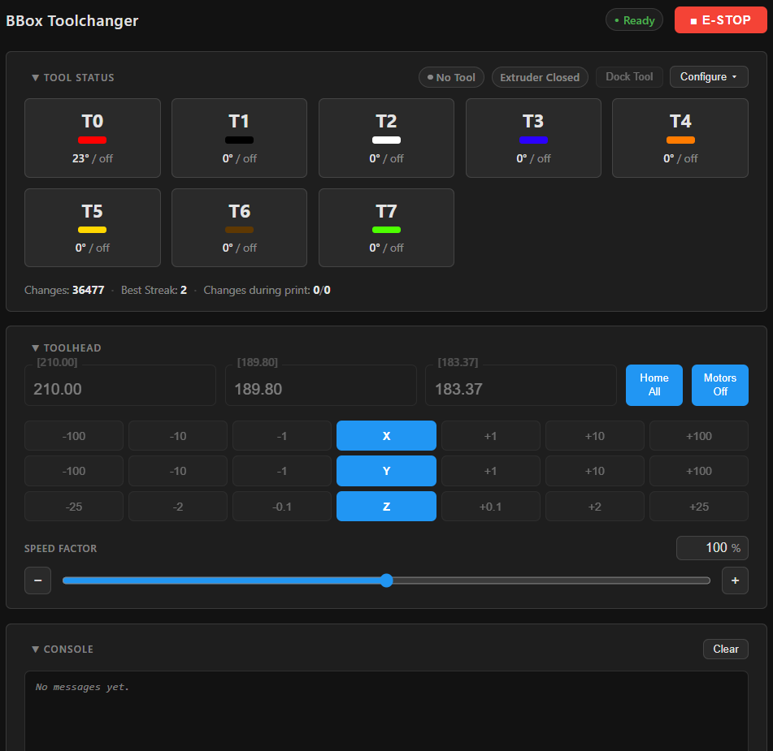
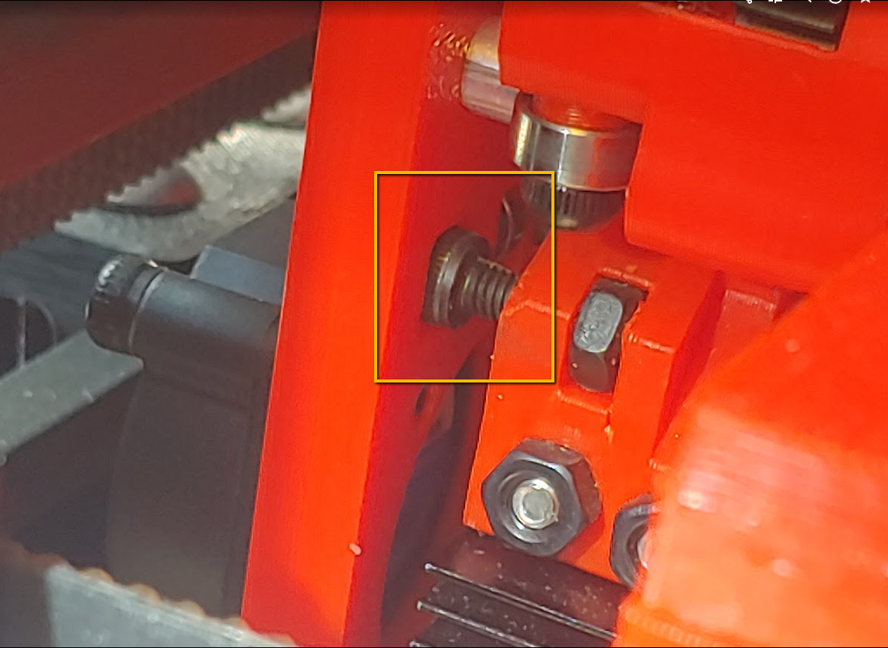
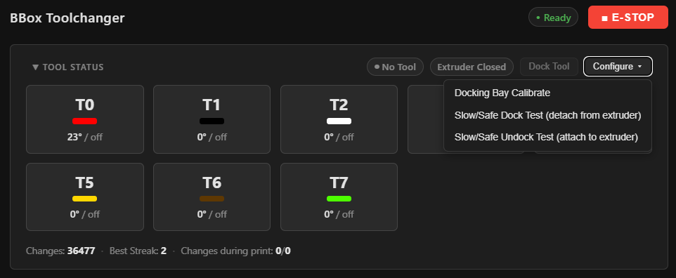

# BBox KTC (BBox Klipper Toolchanger)

BBox KTC is a software package consisting of a Klipper extension, configuration and macro files, and a web based UI panel of utilities for controlling and configuring a BBox toolchanger. 

This package simplifies the setup, configuration and use of a BBox toolchanger printer.

## Installation

Run this on your Klipper host over SSH:

```
wget -O - https://raw.githubusercontent.com/sakitume/BBox-KTC/main/install.sh | bash
```

This will go through a series of steps to install BBox KTC onto your klipper host. You will be asked for permission for several of these steps. You can hit your "Enter" key to accept the default or enter "Y" or "N" to accept or decline. After it completes Klipper will be restarted. At this point you should see several warnings and/or errors in the Mainsail/Fluidd console. These will tell you that there are few settings that still need to be setup before you can use your toolchanger.

> For details on what the installer will do check out the [Installation Details](Installation-Details.md).

## KTC UI Panel
To access the UI panel point your web browser to the same URL you are using for Mainsail. For example I have a printer named `bbox235.local` and I use `http://bbox235.local` to view Mainsail. I would then edit that URL by appending `/bbox` to it so it becomes `http://bbox235.local/bbox` and then hit the enter key. This will take you to the BBox Toolchanger UI panel. Try this now using your printer's address.



> Note: The above screenshot is of a printer that has already been configured with 8 tools and assigned filament colors. Your initial UI panel will not look like this.

This panel does not replace Mainsail/Fluidd but does provide similar features so that you don't have to switch between this panel and Mainsail/Fluidd. For example it has a console as well as a toohead positioning panel.

Having this UI panel available during the setup and configuration phase can be helpful.

## Setup
You will need to edit the `bt_customize.cfg` file in a few key places to complete the installation and remove the errors/warnings. Take the time to read through the file and you should see what will be needed:

* Edit `variable_x_locs` so it has a number for every tool you currently have installed. Use a `,` between each number. You can use `0` for the number. These are just placeholder numbers for now and will be replaced by the calibration tool described later.
  * For example if you have 3 tools then this is how that would look: `variable_x_locs: [0,0,0]`
* Uncomment the `[gcode_button tool_detect]` section and provide a `pin` definition. There are instructions in the file that will guide you on how to do this.

> Note: There are additional sections in `bt_customize.cfg` that you can edit to enable a few calibration methods but we'll defer that for later.

### Extruder/Tool configuration
You should already have a functional `[extruder]` section defined in your `printer.cfg` or (even better) in another `.cfg` file that is included by your `printer.cfg`. If you don't have one setup already you must do so before continuing. This is a standard/typical extruder definition. You can refer to any Klipper guide on how to do that if you're not familiar with this.

The main `extruder` will be for your first tool known as `T0`. You will need to create additional extruder section definitions for each additional tool you have. They need to be named `extruder?` where the `?` is replaced with the tool number. For example for tool `T1` you should create an `[extruder1]` section and provide pin definitions for the heater and the sensor. The following is an example that you can copy/paste
but be sure you edit the `heater_pin` and `sensor_pin` values so that they match the mcu:pin you will be using for this extruder.

```
#-------------------------------------------------------------------------------
[extruder1]
# Everything except the lines below is inherited from [extruder] at startup by
# the BBox-KTC extension. Run BT_CHECK_CONFIG to see what was inherited.
# An explicit value set here always wins, as do PID values saved by SAVE_CONFIG:
#   PID_HOTEND TOOL=1
heater_pin: PB0   # KP3 HE2 heater for hotend 2
sensor_pin: PC2   # KP3 TH2 thermistor
```

Do this for each tool. If you add more tools in the future repeat this process and use increasing numbers
(`extruder2`, `extruder3`, etc).

> Note: Normally Klipper would require you to enter a lot more values in these `[extruder?]` sections but the BBox KTC extension will automatically assign those values using the ones from the main `[extruder]` section. This happens behind the scenes to make defining a new `[extruder?]` section much easier as well as less error prone. You can always provide custom values as needed for any extruder.

### Hotend and Dock fans
You will need to provide `[heater_fan]` definitions for the toolhead hotend fan as well as for the dock fans.
Here are some examples you can copy/paste but (as usual) you must edit the `pin` definitions to match your mcu:pin you will be using.

```
#--------------------------------------------------------------------
[heater_fan bt_hotend_fan]
pin: gpio18
heater_temp: 50.0

#--------------------------------------------------------------------
[heater_fan bt_dock_fan]
pin: gpio20                 # SKR-Pico Fan3
heater_temp: 50             # The temperature the extruder must reach to start the fan
```

**It is important you use a `bt_` prefix for the names of these fans (like `bt_hotend_fan` and/or `bt_dock_fan`)** as shown in these examples. This lets BBox KTC automatically assign all of the extruder heaters to these fans. Otherwise you would have to manually add a `heater:` line and assign these extruder heaters by hand. This gets unwieldly and is error prone if you add tools and forget to update these sections.

> Note: You may already have an existing `[heater_fan]` defined for your main `extruder`. If it doesn't use the `bt_` prefix in its name than BBox KTC will have logged a warning in the console. You should add the `bt_` prefix as described above.

### Restart Klipper
Use MainSail/Fluidd to restart Klipper and then review the console. You should hopefully not see any errors or warnings except for one:

```
ERROR: dock_y is 10000, outside the Y axis travel
```

This value will be properly configured after you successfully run the "Docking Bay Calibrate" procedure. But if you see any other errors or warnings carefully read what is being reported so that you can address these issues before continuing.

### Docking Bay positioning
The goal is to adjust the X position of the first docking bay triplet as well as the Y position of the 2020 extrusion that these docking bay triplets mount to. 

> Note: Docking bays come in triplets (3 to a single printed part). This has a nice side effect that you only need to calibrate one of the tools and the other 2 can have their values be set automatically from the 1st.

Ensure you have a docking bay triplet loosely installed onto the 2020 at rear left. You should be able to slide it left/right without too much difficulty but not so loose it can fall off or has too much wobble. 
Home your printer to X min, Y min (which is front left of printer). This might be X==0 or less than 0 depending on your printer. You can keep it here or move to X==0, it isn't critical. 

Insert a tool into the extruder (open the extruder arm slightly if you have filament in the tool). Then turn off the stepper motors (using KTC UI Panel or Mainsail/Fluidd or enter `M84` in the console). This will let you move the gantry by hand; move it all the way to the rear of the printer so that the docking bay pins on the back of the tool will just start to enter the two holes of the first docking bay. 



You will likely need to adjust the vertical position of the 2020 extrusion so that the docking pins are centered vertically with their respective holes in the bay. Similarly you will likely need to slide the docking bay left/right to line up the pins with the holes.

When adjusting the height of the extrusion be sure to adjust the right side clamp to keep the 2020 extrusion level. The 2020 extrusion will usually end up less than a millimeter above the BBox A/B motor mount screws. After the 2020 extrusion is in position you will tighten the screws that mount it and also the screws for the docking bay.

> Note: You should fine tune the right side clamp for the 2020 when you calibrate the additional docking bays that are closer to that right side. You can install additional docking bay triplets at this time if you wish. I usually space them apart by a very small gap (maybe 0.5mm).

## Calibration
Now that the first docking bay triplet is installed into position we will need to configure BBox KTC so that it knows the exact location of the docking bays you have installed.

### The manual method
The manual method of doing this involves using KTC UI Toolhead placement panel or Mainsail/Fluidd to jog an attached tool into position so the docking bay pins are centered vertically to their holes and *just* clear of the left edge of their holes. You also make sure the tool is fully inserted into the docking bay (no gap between back of tool and front of docking bay). You then copy the X/Y positions and edit your `bt_customize.cfg` with those values.

Set the `variable_dock_y` with the Y position you copied. And adjust `variable_x_locs` so you can apply X value you copied into it. You can actually use some math to set the correct values for the other tools.

This can work really well if you were careful in aligning the 2020 extrusion and your first docking bay so that the X-carriage was at X==0, you can end up editing your `bt_customize.cfg` so it looks something like this:

```
variable_x_locs: [0, 30, 60, 90, 120, 150, 180, 210]
```

This is because docking bays are 30mm apart from one another. Of course you need to double-check the position of each triplet as the printed parts usually print a little less than 90mm in width so each docking bay triplet is usually spaced spaced a tiny bit from the previous.

> Note: These values really need to be precisely calibrated. The mechanism allows a slight amount of tolerance but generally speaking you want to have these values really dialed in.

### The semi-automated method
The BBox KTC UI panel provides a way to interactively calibrate the X/Y positions of your tools, guiding you through the process with a series of dialogs. This "Wizard" will then save the values for you automatically into your `bt_customize.cfg` file.

At the top right of the "TOOL STATUS" section is a "Configure" button. This button will display several configuration helpers that will help with calibrating docking bay positions as well as testing tool docking and undocking. 



Click this button and choose the "Docking Bay Calibrate" helper. This will activate  the calibration wizard which will guide you each step of the way. Take advantage of the "auto" calibrate feature for the additonal tools for that docking bay. 

### Dock/Undock testing
After the docking bay positions have been calibrated you should now perform basic dock/undock testing.

Docking and undocking (by default) are done at high speeds. But for *initial testing* you should go very slow to avoid (or reduce) breakage if something goes wrong. 

You will use the "Slow/Safe Dock Test (detach from extruder)" and the "Slow/Safe Undock Test (attach to extruder)"
(from the "Configure" button menu) to perform these initial tests at the recommended slower speeds.

> Note: Docking/Undocking requires opening and closing the extruder arm. At this time you will not be printing. So you should make sure the tensioner spring on the extruder arm is very loose. Just enough so that the arm closes and does not require much force to open. You will fine tune this tension later on when you perform print tests.

#### Docking Test
Start off with the "Slow/Safe Dock Test (detach from extruder)" helper. Instructions for each step will be provided. Hopefully this test will succeed without issue. But if you encounter any issues....

Try and see if there may be any positioning issues. Because the movements are at 8 percent speed you should be able to visually observe (or even hear) if there is any binding or obstructions that could be causing issues.

Here are some things to consider when running this test:
* Make sure the pins are entering cleanly and are centered vertically into their docking bay holes and are clearing the left edge of their holes.
* If the vertical positioning is off then you'll need to readust the 2020 extrusion. 
* If the left/right positioning is slightly off you have 3 options:
  1) Loosen the docking bay and slide it so the pins are centered
  2) You can run the calibration wizard again and retry until its better. 
  3) You can adjust the X position manually using KTC UI Panel until it lines up nicely. Then use the value displayed by KTC UI Panel for X to adjust the position(s) for the tools. This means editing the values in `bt_customize.cfg`

If the tool did not stay in the dock but the positioning/movement seemed correct, the docking pins on the tool might need adjustment and/or the vertical position of the docking bay needs more tuning. Visually confirm it all looks good. You can also run the calibration wizard again and retry.

For docking pins issue manually insert the tool into the dock and make sure the tool can slide left/right and that it isn't too tight nor too loose. Adjust the pins (screwing them in or out) and test fitment again. You can play with this and retry to see if making it more loose or more tight addresses the situation.

Hopefully you get this to work and the tool is docked. If not stick with it until you can get this working and look and also listen during these steps to see if there's anything that might yield a clue as to what is preventing this from working.

#### Undocking Test
Now that you can dock the tool let's see if we can undock it (attach into extruder). For this test choose the "Slow/Safe Undock Test (attach to extruder)" menu item. Follow the steps provided by the Wizard.

If undocking fails try the suggestions previously given for diagnosing docking failures as these failures often share similar causes. 

### Test the remaining tools
Once you can safely dock and undock using the slow/safe tests you can use the KTC UI panel to easily perform full speed dock/undock tests by using the T0, T1, etc buttons to load a tool into the extruder and the "Dock Tool" button to unload the current tool and park it into its docking bay.

You can use also perform automated/repeated tests. You can use the `BT_TEST_CYCLE` command to cycle loading different tools. Let's say you have 3 tools (`T0`, `T1`, `T2`) you could enter the following into the console to cycle the loading/unloading of those tools:

```
BT_TEST_CYCLE TOOLS=0,1,2 COUNT=4
```

You specify which tools to test (they do not need to be sequential) using the `TOOLS` parameter and using commas between the tool numbers. You can specify the number of times to cycle through the tools with the `COUNT` parameter

> Note: You can test different tools in any order like so: `BT_TEST_CYCLE TOOLS=0,5,2,7,1,3`

## Available Commands
For a complete listing of available commands you can refer to this document: **TODO**


## Credits
The BBox KTC (BBox Klipper Toolchanger) package was developed by Sakitume.

The nozzle-probe XYZ tool-offset calibration code in this project is adapted
from prior open-source work:

- [Klipper](https://github.com/Klipper3d/klipper) itself (Kevin O'Connor and
  contributors) — GPL-3.0.
- [ben5459/Klipper_ToolChanger](https://github.com/ben5459/Klipper_ToolChanger)'s
  `probe_multi_axis.py`, itself adapted from code by Kevin O'Connor and
  Martin Hierholzer.
- [viesturz/klipper-toolchanger](https://github.com/viesturz/klipper-toolchanger)'s
  `tools_calibrate.py` (GPL-3.0) — `bbox_tools_calibrate.py` is directly
  adapted from it: we dropped `TOOL_CALIBRATE_SAVE_TOOL_OFFSET` in favor of
  our own `BT_SAVE_TOOL_OFFSET`/`variables.cfg` persistence, and fixed a
  stale-position bug in `locate_sensor()`.

## License

This repo carries two licenses, scoped by directory:

- **`BBox-KTC/`** (the Klipper extras/macros) — GPL-3.0, inherited
  from the Klipper-derived nozzle-probe code credited above. See
  [LICENSE](LICENSE).
- **`bbox-ui-dist/`** (the built web UI) — MIT. It's a separate,
  independently-functioning program that only talks to the toolchanger over
  Moonraker's network API, not GPL-covered code. See
  [bbox-ui-dist/LICENSE](bbox-ui-dist/LICENSE).
